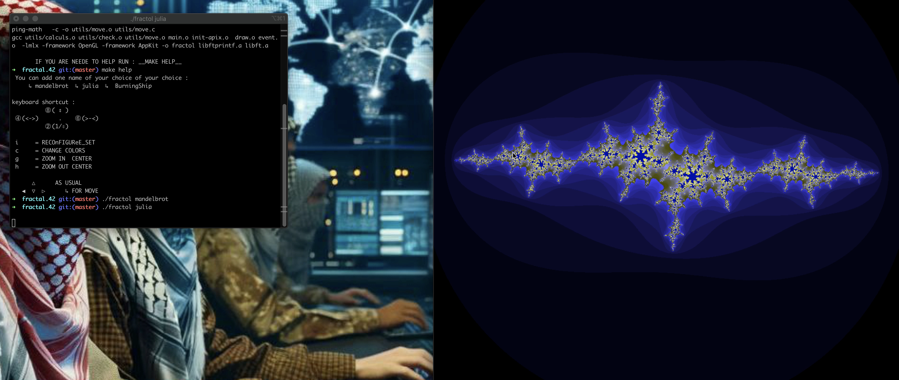

# Fractal 

### Discover 2D programming and the psychedelic universe of fractals in this project, using [minilibx](https://harm-smits.github.io/42docs/libs/minilibx.html) (42). 

#  Keywords

- 2D programming
- Optimization techniques
- Some Maths

# Skills

- Graphics
- Imperative programming 

# fractal sets
- ## mandelbrot set
- 
- ##  julia set
- 
- ## burningship set
- 

